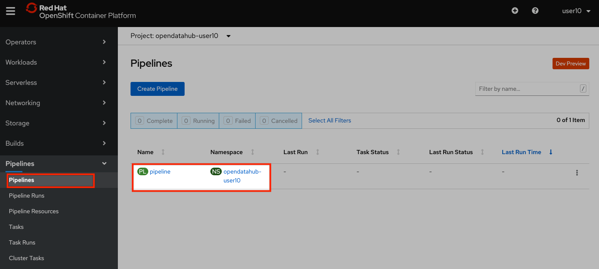

:USER_GUID: %guid%
:USERNAME: %user%
:PASSWORD: %openshift_password%
:markup-in-source: verbatim,attributes,quotes
:show_solution: true

In this section you will learn how to use OpenShift Pipelines to build a RESTful service for making predictions, using the model you just trained.

=== Accessing the build pipeline

Visit https://console-openshift-console.apps.cluster-{USER_GUID}.{USER_GUID}.events.opentlc.com/[the OpenShift Console].
By now, you should have completed the "Logging into Openshift" section. 
If you did not, return to the previous step.

In the sidebar menu, navigate to the "Pipelines" section and open the "Pipelines" subsection.
You should see now the build pipeline. 

You can click on the pipeline to inspect its definition. 
A build pipeline is made of one or more tasks. 
For this lab, we will run a build pipeline with two tasks running sequentially:

* a task that will build a container image that contains the model we trained and push it to an OpenShift Image Stream;
* a task that will deploy service using OpenShift Serverless

Now you can return to the previous menu, and start the pipeline.

You will be prompted with the pipeline run parameters, which should look like in the picture below.

Confirm that the values are correct, then press "Start".
As the pipeline runs, the OpenShift console will display the progress of the pipeline tasks. 
You can click on the running task to inspect the logs.

The log screen should look as follows:

Wait until the build pipeline completes.
It can take a few minutes. 
Once it does, you can proceed to inspect your newly deployed service.

=== Accessing the Model Service

After the build pipeline has completed, you should have a serverless service deployed in your project.

You can see it by navigating to the Serverless section in the side menu.

Make note of your service URL. 
It should look like `http://pipeline.opendatahub-{USERNAME}.svc.cluster.local`.
This is the URL that you will use for the next step, for which you will return to JupyterHub.

__(Note that this service is only visible from within the cluster, so it won't be able to access it in the browser.)__

=== Making Predictions Using the Model Service

Congratulations!
You have successfully built and deployed a service that makes predictions based on the model you trained earlier.
Now you can return to https://jupyterhub-opendatahub-{USERNAME}.apps.cluster-{USER_GUID}.{USER_GUID}.events.opentlc.com/[JupyterHub] and open the `04-services.ipynb` notebook, which will walk you through a few scenarios where you can invoke this service.

