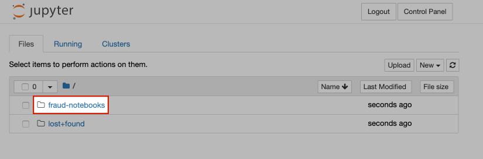

:USER_GUID: %guid%
:USERNAME: %user%
:markup-in-source: verbatim,attributes,quotes
:show_solution: true

You're now inside your JupyterHub instance. The noteboks we will be working with today are in the `fraud-notebooks` folder, so go ahead and click on that. 

If you haven't used Jupyter notebooks before, or are in need of a Jupyter notebook refresher, you should spend some time working through notebook `00-getting-started.ipynb`. It will step you through how to interact with Jupyter notebooks, and how to reset your notebooks if you get really stuck. 

Once you're confident interacting with this Jupyter notebook you are ready to start on the fraud detection use case! 