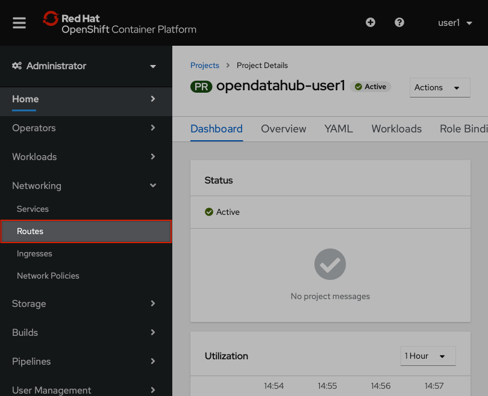
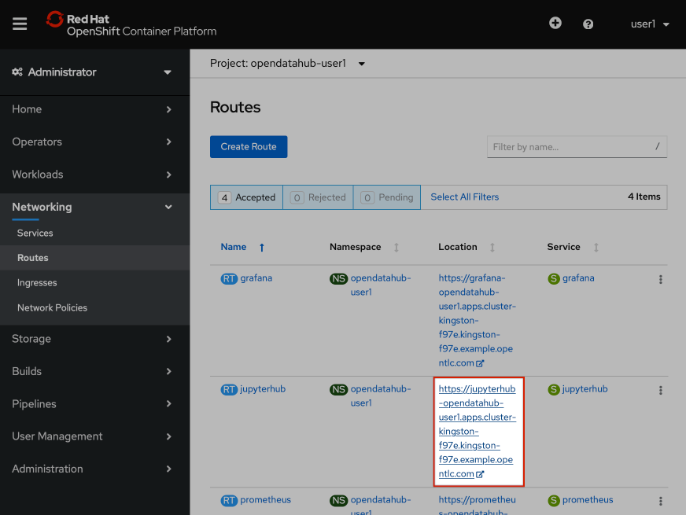
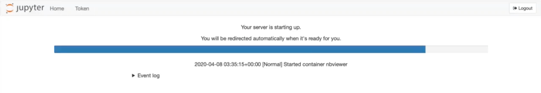

:USER_GUID: %guid%
:USERNAME: %user%
:PASSWORD: %password%
:markup-in-source: verbatim,attributes,quotes
:show_solution: true

=== Logging into JupyterHub 

Today we'll be working in JupyterHub, a interactive development environment which serves Jupyter Notebooks. JupyterHub is already installed in your OpenShift project and we access it through a `route`. 

From the menu on the left-hand side of your OpenShift Console you will need to click on 'Networking' then 'Routes':

This shows all of the routes which are exposed in your project. Access the route for your JupyterHub instance by clicking on the url for `jupyterhub`, which sits under the 'Location' column.

__(The urls given under 'Location' will differ from those shown in the image above.)__

This url will take you to a page asking you to 'Sign in with OpenShift'. Go ahead and click that big orange button.

image::jh-sign-in-with-os.png[]

In order to access Jupyterhub you need to re-authenticate with the username and password you used to login to OpenShift. Go ahead and enter your username and password: 

Your username is: *{USERNAME}*

Your password is: *{PASSWORD}*

This will take you to a page asking you to authorise some requested permissions. You need to click 'Allow selected permissions' in order to continue with the workshop. Once you've authorised access You'll see the JupyterHub Spawner Options screen:

image::jh-spawner.png[]

**All these variables have been pre-set to the correct values for you, so do not change any spawner options**

From top to bottom, the variables on this page are:

- an image to run our environment in. Notebook images contain pre-loaded libraries. For today's workshop this should be set to `ml-workflows-notbook:latest`. 
- t-shirt sizing for the environment. Make sure you keep this as `Default`, else you won't be able to run the notebooks.
- the number of GPUs you want to use. (We don't have any GPUs on the cluster we're working on today, so keep this at `0`!)
- Environment variables relating to the persistent volume which JupyterHub creates in our project:
	
	- the location of a git repo containing the notebooks you want to clone into your persistant volume. The repo for this workshop is https://github.com/willb/fraud-notebooks. 
	- secrets and access keys for any other storage you wish to connect to. (This should be left blank.)
	- any extra variable names you want to specify. (This should also be left blank.)
	
Go ahead and click `Spawn`. JupyterHub will set up that environment for you. This may take a few minutes and whilst the environment is spawning you will see a loading bar like this: 

Congratulations! You've spawned a JupyterHub instance inside your OpenShift project. Now you're ready start working on your fraud detection model.
