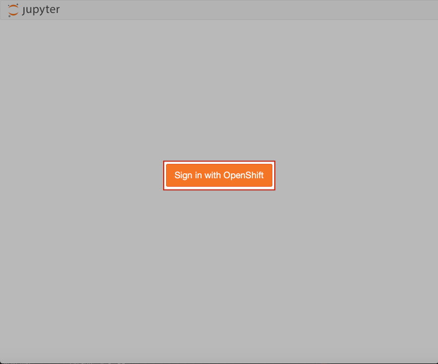
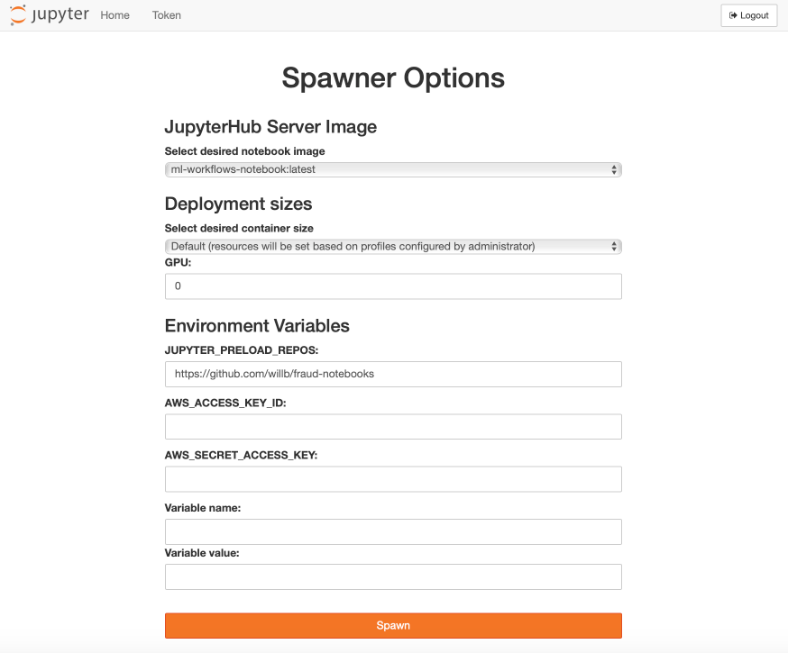
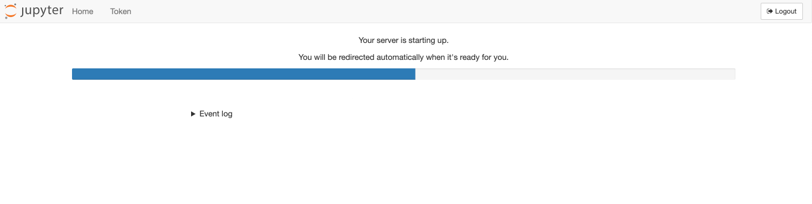

:USER_GUID: %guid%
:USERNAME: %user%
:PASSWORD: %openshift_password%
:DOMAIN: %openshift_route_domain%
:markup-in-source: verbatim,attributes,quotes
:show_solution: true

Today we'll begin by working in JupyterHub, a interactive development environment which serves Jupyter Notebooks. JupyterHub is running in your OpenShift project and you can access it directly by clicking https://jupyterhub-opendatahub-{USERNAME}.apps.cluster-{USER_GUID}.{USER_GUID}.{DOMAIN}/[here].

This url will take you to a page asking you to 'Sign in with OpenShift'. Go ahead and click that big orange button.

You will be taken to a sign in page, and need to enter the following username and password:

Your username is: *{USERNAME}*

Your password is: *{PASSWORD}*

You will then be asked to authorise some requested permissions. You need to click 'Allow selected permissions' to continue with the workshop. Once you've authorised access, you'll see the JupyterHub Spawner Options screen:

**All these variables have been pre-set to the correct values for you, so do not change any spawner options.**

From top to bottom, the variables on this page are:

* an image to run our environment in. Notebook images contain pre-loaded libraries. For today's workshop this should be set to `ml-workflows-notbook:latest`. 
* t-shirt sizing for the environment. Make sure you keep this as `Default`, else you won't be able to run the notebooks.
* the number of GPUs you want to use. (We don't have any GPUs on the cluster we're working on today, so keep this at `0`!)
* Environment variables relating to the persistent volume which JupyterHub creates in our project:
** the location of a git repo containing the notebooks you want to clone into your persistant volume. The repo for this workshop is https://github.com/willb/fraud-notebooks. 
** secrets and access keys for any other storage you wish to connect to. (This should be left blank.)
** any extra variable names you want to specify. (This should also be left blank.)
	
Go ahead and click `Spawn`. JupyterHub will set up that environment for you. This may take a few minutes and whilst the environment is spawning you will see a loading bar like this: 

Congratulations! You've spawned a JupyterHub instance inside your OpenShift project. Now you're ready start working on your fraud detection model.
