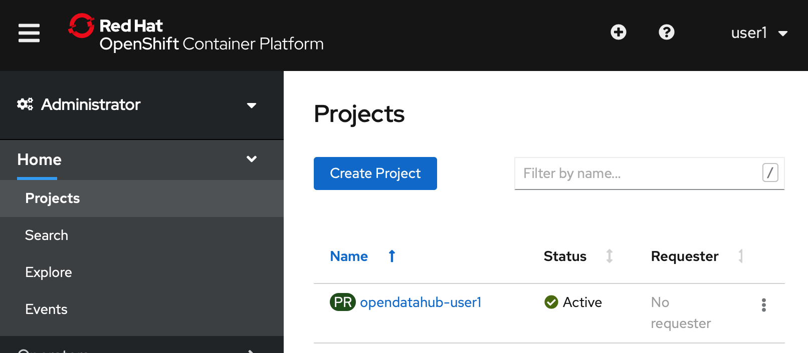
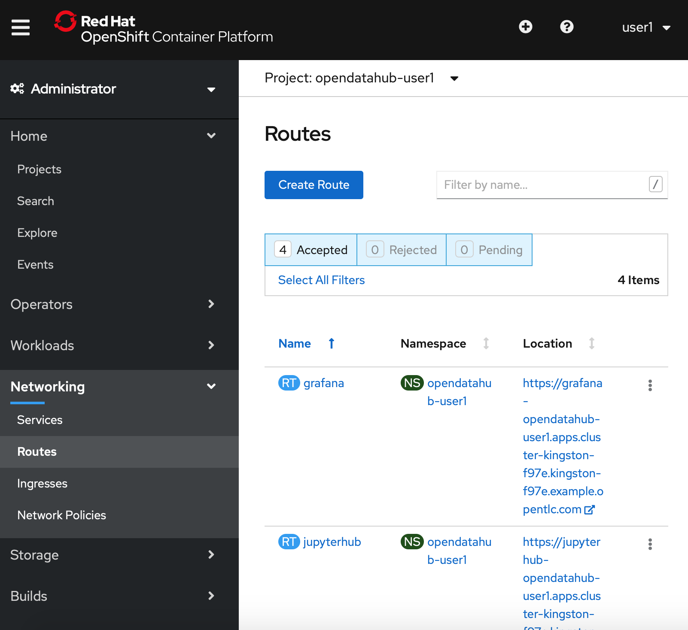

:USER_GUID: %guid%
:USERNAME: %user%
:PASSWORD: %password%
:markup-in-source: verbatim,attributes,quotes
:show_solution: true

In today's lab we wil be working solely with the OpenShift Console. The console is accessed through a url in your web browser, and you will have to log in with your unique username and password, given below.

In this section we will guide you through the log in process and get you set up for the workshop. We will:
- log into OpenShift
- access your OpenShift project 
- log into JupyterHub
- access the Jupyter notebooks that you'll be working through

=== Logging into the Openshift Console

Visit **VISIT WEBSITE?** where you should see a screen like this:

image::ocp-login.png[]

Enter your username and password, which are given below: 

Here is some important information about your environment:

Your GUID is: *{USER_GUID}*

Your username is: *{USERNAME}*

Your password is: *{PASSWORD}*

Once you click `Log In` you will be taken to a page that looks something like this: 

(Note that your project name and the username in the top right hand corner will differ from what you see here, showing your username instead.)

Go ahead and click on your project name to access your personal project. (Shown here as 'opendatahub-user1'.) 

Your project landing page, shown below, shows everything going on within your project. 

image::project-landing-page.png[]

=== Logging into JupyterHub 

Today we'll be working in JupyterHub. We access JupyterHub through an external route. To access this, select 'Networking' then 'Routes' from the left hand side of the OpenShift Console. 

This shows all the external routes which are exposed. Access the route for your JupyterHub instance by clicking on the url for jupyterhub, which sits under the 'Location' column.

In order to access Jupyterhub you need to re-authenticate with the username and password you used to login to the system. 

This will take you to a screen that looks like this. 

File directory for a persistent volume. 

We are ready to get started. 
---

--- 

Congratulations, we're now ready to get started with the workshop

