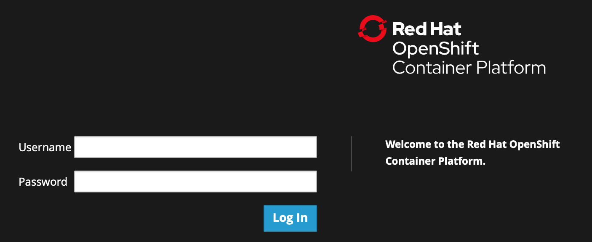
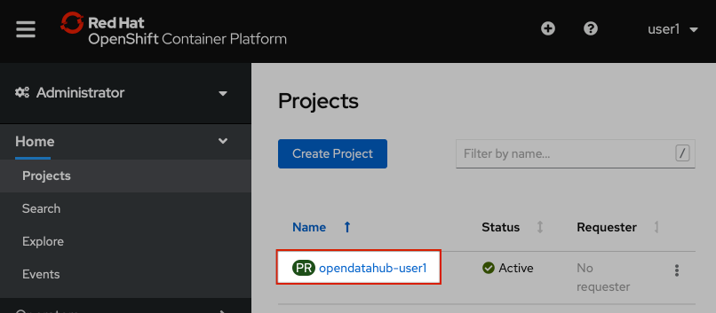
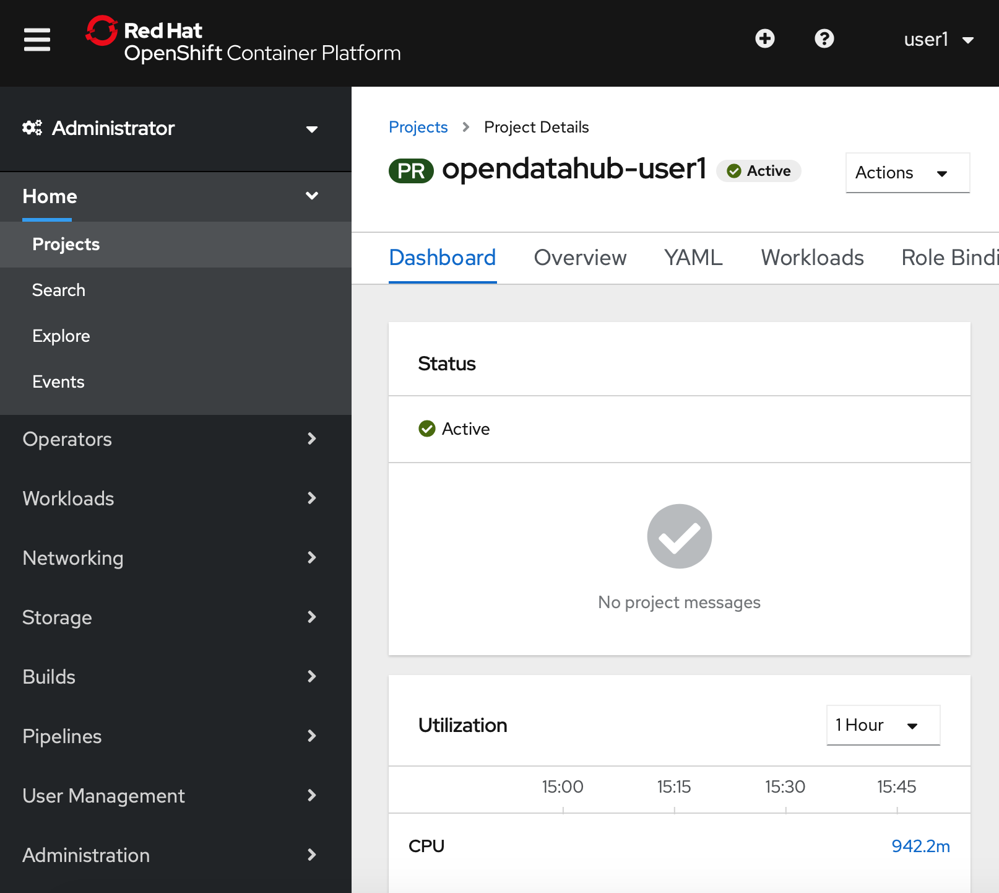

:USER_GUID: %guid%
:USERNAME: %ocp_username%
:OPENSHIFT_URL: %web_console_url%
:JUPYTERHUB_URL: %jupyter_url%
:markup-in-source: verbatim,attributes,quotes
:show_solution: true

=== Logging into the Openshift Console

Visit {OPENSHIFT_URL}[the OpenShift Console] where you will see a screen like this:

Enter your username and password:

Your username is your OpenTLC Username: *{USERNAME}* 

Your password is your OpenTLC Password.

Once you enter your details and click `Log In` you will be taken to a page that looks something like this: 

image::images/landing-page.png[width=750]

__(Note that your project name and the username in the top right hand corner will differ from what you see here, reflecting your username instead.)__

Go ahead and click on your project name to access your personal project:

__(The project name is shown here as 'opendatahub-user1', but yours will be 'opendatahub-*s2s-{USER_GUID}-project*.)__

This will take you to a page showing your project details: 

__Note that again your project name will differ from that shown in the image above.__

Congratulations! You are now logged into OpenShift 4 and have accessed your Project. In the next section will we will build and deploy the model service. 
